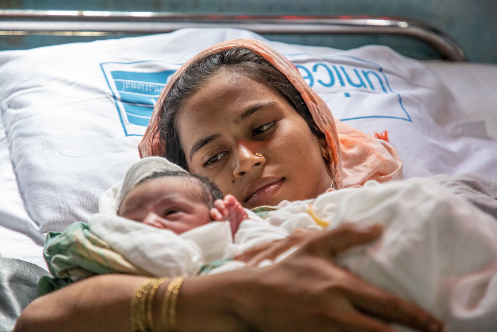

```{python}
#| include: false
import os
import polars as pl
from pathlib import Path
from plotnine import *
```

```{python}
#| include: false
PROJECT_DIR = Path.cwd()
DATA_DIR = PROJECT_DIR

MPLCONFIGDIR = PROJECT_DIR / ".mplconfig"
MPLCONFIGDIR.mkdir(exist_ok=True)
os.environ["MPLCONFIGDIR"] = str(MPLCONFIGDIR)

birth_group_order = ["Low birth rate", "Medium birth rate", "High birth rate"]
birth_group_colors = {
    "Low birth rate": "#3d6f8e",
    "Medium birth rate": "#9ca8a6",
    "High birth rate": "#cf7b3a",
}
focus_countries = ["Afghanistan", "Mozambique", "Uganda", "Tanzania, United Republic of", "Rwanda", "Senegal"]
label_countries = ["Somalia", "Chad", "Niger", "Afghanistan", "Liberia", "Sierra Leone"]

chart_theme = theme_minimal() + theme(
    plot_title=element_text(weight="bold", size=15, color="#17324d"),
    plot_subtitle=element_text(size=10, color="#5c6770"),
    axis_title_x=element_text(weight="bold", color="#17324d"),
    axis_title_y=element_text(weight="bold", color="#17324d"),
    axis_text=element_text(color="#4d5963"),
    legend_title=element_text(weight="bold", color="#17324d"),
    legend_text=element_text(color="#4d5963"),
    plot_background=element_rect(fill="#fbfaf4", color="#fbfaf4"),
    panel_background=element_rect(fill="#fcf7e8", color="#eadfbe"),
    panel_grid_minor=element_blank(),
    panel_grid_major=element_line(color="#e6dcc3", size=0.35),
)
```

```{python}
#| include: false
indicator2 = pl.read_csv(DATA_DIR / "unicef_indicator_2.csv")
metadata = pl.read_csv(DATA_DIR / "unicef_metadata.csv")

indicator2 = indicator2.with_columns(
    pl.col("time_period").cast(pl.Int64),
    pl.col("obs_value").cast(pl.Float64).alias("anc4"),
)

metadata = metadata.with_columns(
    pl.col("year").cast(pl.Int64),
    pl.col("Population, total").cast(pl.Float64, strict=False).alias("population_total"),
    pl.col("GDP per capita (constant 2015 US$)").cast(pl.Float64, strict=False).alias("gdp_per_capita"),
    pl.col("Birth rate, crude (per 1,000 people)").cast(pl.Float64, strict=False).alias("birth_rate"),
)

joined = (
    indicator2.join(
        metadata,
        left_on=["alpha_3_code", "time_period"],
        right_on=["alpha_3_code", "year"],
        how="left",
    )
    .with_columns(
        pl.when(pl.col("birth_rate") >= 30)
        .then(pl.lit("High birth rate"))
        .when(pl.col("birth_rate") >= 20)
        .then(pl.lit("Medium birth rate"))
        .otherwise(pl.lit("Low birth rate"))
        .alias("birth_group")
    )
    .with_columns(
        (pl.col("population_total") * (pl.col("birth_rate") / 1000.0)).alias("estimated_births")
    )
    .with_columns(
        (pl.col("estimated_births") * (1 - pl.col("anc4") / 100.0)).alias("births_without_anc4")
    )
)

latest_year_by_country = joined.group_by("alpha_3_code").agg(pl.max("time_period").alias("latest_year"))
latest = (
    joined.join(latest_year_by_country, on="alpha_3_code", how="left")
    .filter(pl.col("time_period") == pl.col("latest_year"))
    .drop("latest_year")
)
clean_latest = latest.filter(pl.col("birth_rate").is_not_null() & pl.col("anc4").is_not_null())

birth_group_summary = (
    clean_latest.group_by("birth_group")
    .agg(pl.mean("anc4").alias("avg_anc4"), pl.len().alias("country_count"))
    .with_columns(
        pl.col("birth_group").cast(pl.Enum(birth_group_order)),
        pl.col("avg_anc4").round(1).cast(pl.String).alias("label"),
    )
    .sort("birth_group")
)

headline_missed_births = float(clean_latest["births_without_anc4"].sum())
headline_missed_births_assignment1 = float(
    joined
    .filter(
        pl.col("population_total").is_not_null()
        & pl.col("birth_rate").is_not_null()
        & pl.col("anc4").is_not_null()
    )
    .group_by("alpha_3_code")
    .agg(pl.mean("births_without_anc4").alias("avg_births_without_anc4"))
    .get_column("avg_births_without_anc4")
    .sum()
)
low_birth_avg_anc4 = float(clean_latest.filter(pl.col("birth_group") == "Low birth rate")["anc4"].mean())
high_birth_avg_anc4 = float(clean_latest.filter(pl.col("birth_group") == "High birth rate")["anc4"].mean())
coverage_gap = low_birth_avg_anc4 - high_birth_avg_anc4

scatter_df = clean_latest.select("country", "birth_rate", "anc4", "birth_group")
labels_df = scatter_df.filter(pl.col("country").is_in(label_countries))

time_df = (
    joined.filter(pl.col("country").is_in(focus_countries))
    .select("country", "time_period", "anc4")
    .drop_nulls("anc4")
    .sort(["country", "time_period"])
)
```

## Introduction

UNICEF recommends that pregnant women receive **at least four prenatal checkups** during pregnancy. Yet the latest available country records still show a clear mismatch between need and access: the places under the greatest demographic pressure are often the same places where maternal care coverage remains weakest.

This report asks a direct question. If demand for maternal care is highest in these settings, why does coverage still fall short? The cross-country pattern is not minor. Using the same estimation logic as the Assignment 1 dashboard, the data imply approximately **`{python} f"~{headline_missed_births_assignment1:,.0f}"`** annual births without full ANC4+ coverage. Low birth-rate countries average **`{python} f"{low_birth_avg_anc4:.1f}"`%** ANC4+ coverage, compared with **`{python} f"{high_birth_avg_anc4:.1f}"`%** in high birth-rate countries, a gap of **`{python} f"{coverage_gap:.1f}"`** percentage points.

## The Geography of the Gap

The global distribution of ANC4+ coverage is not random. The weakest outcomes cluster across parts of Sub-Saharan Africa and South Asia, where health systems often face higher fertility, lower fiscal capacity, and longer distances to care. The map below is a latest-available snapshot by country. Its purpose is to show where the burden concentrates, not to imply that every country is observed in the same year.

{fig-align="center" width="100%"}

## Structural Pressure

A grouped comparison makes the same pattern easier to read than the map alone. Once countries are sorted by birth-rate pressure, the difference in average coverage becomes more direct. Countries in the highest birth-rate group do not perform only marginally worse; they sit substantially below the low birth-rate group in average ANC4+ coverage. This is why the gap should be treated as structural rather than anecdotal.

```{python}
#| label: fig-bar
#| fig-cap: "Average ANC4+ coverage by birth-rate group"
#| fig-align: center
#| out-width: 82%
#| fig-width: 8
#| fig-height: 4.8
(
    ggplot(birth_group_summary, aes("birth_group", "avg_anc4", fill="birth_group"))
    + geom_col(width=0.68, show_legend=False)
    + geom_text(aes(label="label"), va="bottom", size=9)
    + scale_fill_manual(values=birth_group_colors)
    + scale_x_discrete(limits=birth_group_order)
    + scale_y_continuous(limits=[0, 100], breaks=list(range(0, 101, 20)))
    + labs(
        title="Average ANC4+ coverage falls as birth rates rise",
        x="Birth-rate group",
        y="Average ANC4+ coverage (%)",
    )
    + chart_theme
)
```

## Demographic Pressure and Coverage

The scatterplot below tests the core claim directly. Countries facing greater demographic pressure tend to provide fewer women with the recommended four prenatal visits. The regression line does not establish causation, but it does reveal a consistent global relationship. Several countries, including Somalia, Chad, Niger, and Afghanistan, sit clearly in the high-birth, low-coverage part of the chart.

```{python}
#| label: fig-scatter
#| fig-cap: "Birth rate and ANC4+ coverage"
#| fig-align: center
#| out-width: 92%
#| fig-width: 9.5
#| fig-height: 5.6
(
    ggplot(scatter_df, aes("birth_rate", "anc4", color="birth_group"))
    + geom_point(size=2.7, alpha=0.8)
    + geom_smooth(method="lm", se=False, color="#425866", linetype="dashed")
    + geom_text(
        data=labels_df,
        mapping=aes(label="country"),
        nudge_y=1.5,
        size=7,
        show_legend=False,
    )
    + scale_color_manual(values=birth_group_colors, name="Birth-rate group")
    + scale_x_continuous(expand=(0.02, 0.6))
    + scale_y_continuous(limits=[0, 100], breaks=list(range(0, 101, 20)))
    + labs(
        title="Higher birth rates are often linked to lower ANC4+ coverage",
        x="Birth rate, crude (per 1,000 people)",
        y="ANC4+ coverage (%)",
    )
    + chart_theme
)
```

## Progress Over Time

The problem is not static. A broader set of countries is used here because four lines were beginning to over-simplify the story. The six countries shown below all have enough observations to support a time trend, and together they illustrate several different trajectories: persistent shortfall, moderate improvement, and stronger gains under continuing demographic pressure.

```{python}
#| label: fig-time-series
#| fig-cap: "Selected country trends in ANC4+ coverage over time"
#| fig-align: center
#| out-width: 92%
#| fig-width: 10
#| fig-height: 5.8
(
    ggplot(time_df, aes("time_period", "anc4", color="country"))
    + geom_line(size=1.15)
    + geom_point(size=2)
    + scale_y_continuous(limits=[0, 100], breaks=list(range(0, 101, 20)))
    + labs(
        title="Progress over time has been real, but uneven",
        x="Year",
        y="ANC4+ coverage (%)",
        color="Country",
    )
    + chart_theme
    + theme(legend_position="bottom")
)
```

## Why This Matters

{fig-align="center" width="88%"}

Behind every percentage point is a woman who may move through pregnancy without adequate support. The data in this report suggests that the places with the greatest need for maternal care are often those where access remains most constrained.

This matters beyond one indicator. Antenatal care is a basic point of entry into safer pregnancy, earlier detection of risk, and better maternal and child health outcomes. When access breaks down where fertility is highest, the cost is not abstract. It is concentrated in places where health systems are already under strain.

## Conclusion

Across countries with available data, the pattern is consistent. ANC4+ coverage is weakest where demographic pressure is highest, and the gap remains visible across geography, group averages, and country-level trajectories over time.

The central implication is practical rather than rhetorical. Expanding maternal-care access in high-birth settings requires stronger service delivery, better physical reach, and more targeted support where unmet need is concentrated. In other words, progress depends less on isolated improvement and more on sustained system capacity.

## Related Interactive Dashboard

For a more exploratory version of the same topic, the original Tableau Public dashboard from Assignment 1 is available here: [Exploring Global Inequality in Antenatal Care](https://public.tableau.com/views/BAA1030DataAnalyticsStoryTellingAssignment1/DashboardExploringGlobalInequalityinAntenatalCare?:language=zh-CN&:sid=&:redirect=auth&:display_count=n&:origin=viz_share_link).

## Method Note

- All cross-sectional comparisons use the **latest available year by country**.
- The headline estimate follows the same country-level averaging logic used in Assignment 1, based on population, crude birth rate, and the share of births not covered by ANC4+.
- The UNICEF indicator and World Bank metadata were linked with **alpha_3_code + year**.
- Blank countries on the map indicate that no matching country-year record was available in the provided extract.
